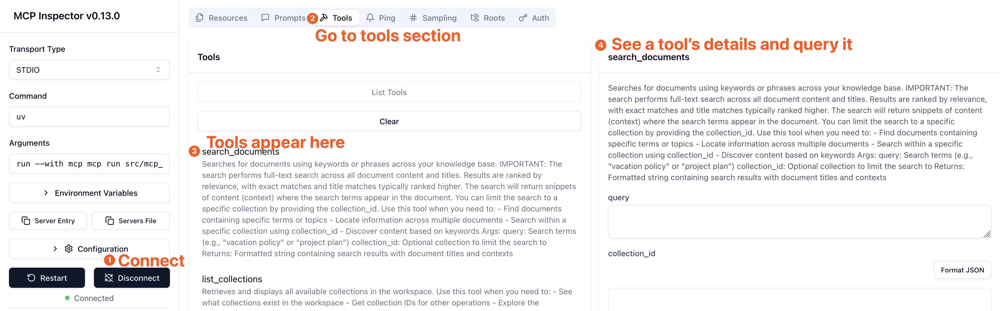

# MCP Outline Server

A Model Context Protocol server for interacting with Outline document management.

## Features

- **Document operations**: Search, read, create, edit, archive documents
- **Collections**: List, create, manage document hierarchies
- **Comments**: Add and view threaded comments
- **Backlinks**: Find documents referencing a specific document
- **Automatic rate limiting**: Transparent handling of API limits with retry logic

## Installation

### Using uv (Recommended)

```bash
uvx mcp-outline
```

### Using pip

```bash
pip install mcp-outline
```

### Using Docker

```bash
docker run -e OUTLINE_API_KEY=<your-key> ghcr.io/vortiago/mcp-outline:latest
```

Or build from source:
```bash
docker buildx build -t mcp-outline .
docker run -e OUTLINE_API_KEY=<your-key> mcp-outline
```

## Configuration

**Important**: This MCP server connects TO an existing Outline instance.
- **MCP Server** (this project) runs on `MCP_PORT` (default: 3000)
- **Outline** (the document app) runs on a different port (e.g., 3030 in docker-compose)
- `OUTLINE_API_URL` tells the MCP server where to find your Outline instance

| Variable | Required | Default | Notes |
|----------|----------|---------|-------|
| `OUTLINE_API_KEY` | Yes | - | API token from Outline Settings → API Keys |
| `OUTLINE_API_URL` | No | `https://app.getoutline.com/api` | Self-hosted Outline: `https://your-domain/api` |
| `MCP_TRANSPORT` | No | `stdio` | `stdio`, `sse`, or `streamable-http` |
| `MCP_HOST` | No | `127.0.0.1` | Use `0.0.0.0` in Docker for external access |
| `MCP_PORT` | No | `3000` | HTTP server port (for `sse`/`streamable-http`) |

## Adding to Your Client

> **Prerequisites**: Install `uv` with `pip install uv` or from [astral.sh/uv](https://docs.astral.sh/uv/)

<details>
<summary><b>Add to Claude Desktop</b></summary>

Edit `~/Library/Application Support/Claude/claude_desktop_config.json` (or `%APPDATA%\Claude\claude_desktop_config.json` on Windows):

```json
{
  "mcpServers": {
    "mcp-outline": {
      "command": "uvx",
      "args": ["mcp-outline"],
      "env": {
        "OUTLINE_API_KEY": "<YOUR_API_KEY>",
        "OUTLINE_API_URL": "<YOUR_OUTLINE_URL>"
      }
    }
  }
}
```

</details>

<details>
<summary><b>Add to Cursor</b></summary>

Go to **Settings → MCP** and click **Add Server**:

```json
{
  "mcp-outline": {
    "command": "uvx",
    "args": ["mcp-outline"],
    "env": {
      "OUTLINE_API_KEY": "<YOUR_API_KEY>",
      "OUTLINE_API_URL": "<YOUR_OUTLINE_URL>"
    }
  }
}
```

</details>

<details>
<summary><b>Add to VS Code</b></summary>

Install the [MCP extension](https://marketplace.visualstudio.com/items?itemName=Claude.Claude) and add to VS Code settings:

```json
{
  "mcp": {
    "servers": {
      "mcp-outline": {
        "command": "uvx",
        "args": ["mcp-outline"],
        "env": {
          "OUTLINE_API_KEY": "<YOUR_API_KEY>",
          "OUTLINE_API_URL": "<YOUR_OUTLINE_URL>"
        }
      }
    }
  }
}
```

</details>

<details>
<summary><b>Add to Cline (VS Code)</b></summary>

In Cline extension settings, add to MCP servers:

```json
{
  "mcp-outline": {
    "command": "uvx",
    "args": ["mcp-outline"],
    "env": {
      "OUTLINE_API_KEY": "<YOUR_API_KEY>",
      "OUTLINE_API_URL": "<YOUR_OUTLINE_URL>"
    }
  }
}
```

</details>

<details>
<summary><b>Using pip instead of uvx</b></summary>

If you prefer to use `pip` instead:

```bash
pip install mcp-outline
```

Then in your client config, replace `"command": "uvx"` with `"command": "mcp-outline"` and remove the `"args"` line:

```json
{
  "mcp-outline": {
    "command": "mcp-outline",
    "env": {
      "OUTLINE_API_KEY": "<YOUR_API_KEY>",
      "OUTLINE_API_URL": "<YOUR_OUTLINE_URL>"
    }
  }
}
```

This approach applies to Claude Desktop, Cursor, VS Code, and Cline.

</details>

<details>
<summary><b>Docker Deployment (HTTP)</b></summary>

For remote access or Docker containers, use HTTP transport. This runs the **MCP server** on port 3000 (separate from your Outline instance):

```bash
docker run -p 3000:3000 \
  -e OUTLINE_API_KEY=<YOUR_API_KEY> \
  -e OUTLINE_API_URL=<YOUR_OUTLINE_URL> \
  -e MCP_TRANSPORT=streamable-http \
  ghcr.io/vortiago/mcp-outline:latest
```

Then connect from client:

```json
{
  "mcp-outline": {
    "url": "http://localhost:3000"
  }
}
```

**Note**: `OUTLINE_API_URL` should point to where your Outline instance is running, not localhost:3000.

</details>

## Tools

- `search_documents(query, collection_id?)` - Search documents by keywords
- `list_collections()` - List all collections
- `read_document(id)` - Get document content
- `create_document(title, content, collection_id)` - Create new document
- `update_document(id, title?, content?)` - Update document
- `move_document(id, collection_id)` - Move to different collection
- `archive_document(id)` - Archive document
- `restore_document(id)` - Restore archived document
- `add_comment(document_id, text)` - Add comment to document
- `list_comments(document_id)` - View document comments
- `get_backlinks(document_id)` - Find documents that link here

## Development

### Quick Start with Self-Hosted Outline

```bash
# Generate configuration
cp config/outline.env.example config/outline.env
openssl rand -hex 32 > /tmp/secret_key && openssl rand -hex 32 > /tmp/utils_secret
# Update config/outline.env with generated secrets

# Start all services
docker compose up -d

# Create API key: http://localhost:3030 → Settings → API Keys
# Add to .env: OUTLINE_API_KEY=<token>
```

### Setup

```bash
git clone https://github.com/Vortiago/mcp-outline.git
cd mcp-outline
uv pip install -e ".[dev]"
```

### Testing

```bash
# Run tests
uv run pytest tests/

# Format code
uv run ruff format .

# Type check
uv run pyright src/

# Lint
uv run ruff check .
```

### Running Locally

```bash
uv run mcp-outline
```

### Testing with MCP Inspector

Use the MCP Inspector to test the server tools visually via an interactive UI.

**For local development** (with stdio):

```bash
npx @modelcontextprotocol/inspector -e OUTLINE_API_KEY=<your-key> -e OUTLINE_API_URL=<your-url> uv run python -m mcp_outline
```

**For Docker Compose** (with HTTP):

```bash
npx @modelcontextprotocol/inspector http://localhost:3000
```

The MCP Inspector allows you to:
- View all available tools
- Test tool calls with custom parameters
- See responses in real-time



## Architecture Notes

**System Architecture**:
```
Client (Claude, Cursor, etc.)
    ↓ connects to
MCP Server (port 3000)
    ↓ calls API to
Outline (port 3030 in docker-compose)
```

Key points:
- Client connects to **MCP Server** on port 3000
- **MCP Server** calls **Outline** API via `OUTLINE_API_URL`
- In docker-compose: Outline runs on port 3030, MCP Server on port 3000
- Do NOT point `OUTLINE_API_URL` to the MCP Server port

**Rate Limiting**: Automatically handled via header tracking (`RateLimit-Remaining`, `RateLimit-Reset`) with exponential backoff retry (up to 3 attempts). No configuration needed.

**Transport Modes**:
- `stdio` (default): Direct process communication
- `sse`: HTTP Server-Sent Events (use for web clients)
- `streamable-http`: Streamable HTTP transport

**Connection Pooling**: Shared httpx connection pool across instances (configurable: `OUTLINE_MAX_CONNECTIONS=100`, `OUTLINE_MAX_KEEPALIVE=20`)

## Contributing

Contributions welcome! Please submit a Pull Request.

## License

This project is licensed under the MIT License - see the [LICENSE](LICENSE) file for details.

## Acknowledgments

- Built with [MCP Python SDK](https://github.com/modelcontextprotocol/python-sdk)
- Uses [Outline API](https://getoutline.com) for document management
