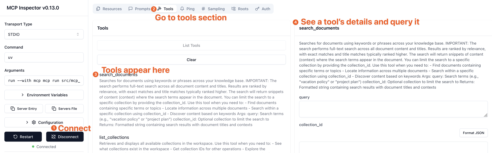

# Development

## Quick Start with Self-Hosted Outline

```bash
# Generate configuration
cp config/outline.env.example config/outline.env
openssl rand -hex 32 > /tmp/secret_key && openssl rand -hex 32 > /tmp/utils_secret
# Update config/outline.env with generated secrets

# Start all services
docker compose up -d

# Create API key: http://localhost:3030 → Settings → API Keys
# Add to .env: OUTLINE_API_KEY=<token>
```

## Setup

```bash
git clone https://github.com/Vortiago/mcp-outline.git
cd mcp-outline
uv sync --extra dev
```

## Testing

```bash
# Run unit tests
uv run poe test-unit

# Run integration tests (starts real MCP server via stdio)
uv run poe test-integration

# Format code
uv run ruff format .

# Type check
uv run pyright src/

# Lint
uv run ruff check .
```

## E2E Tests

E2E tests run against a real Outline instance via Docker Compose. The fixtures
manage the stack lifecycle automatically — just run:

```bash
uv run poe test-e2e
```

The test fixtures automatically:
- Start the isolated Docker Compose stack (`mcp-outline-e2e` project, ports 3031/5557)
- Authenticate via OIDC/Dex to create an API key
- Spawn the MCP server via stdio for each test
- Tear down the stack on exit

To start the E2E stack manually (e.g. for debugging):
```bash
cp config/outline.env.example config/outline.env
DEX_HOST_PORT=5557 OUTLINE_HOST_PORT=3031 \
  docker compose -p mcp-outline-e2e -f docker-compose.yml -f docker-compose.e2e.yml up -d outline
```

See `.github/workflows/e2e.yml` for CI configuration.

## Running Locally

```bash
uv run mcp-outline
```

## Testing with MCP Inspector

Use the MCP Inspector to test the server tools visually via an interactive UI.

**For local development** (with stdio):

```bash
npx @modelcontextprotocol/inspector -e OUTLINE_API_KEY=<your-key> -e OUTLINE_API_URL=<your-url> uv run python -m mcp_outline
```

**For Docker Compose** (with HTTP):

```bash
npx @modelcontextprotocol/inspector http://localhost:3000
```



## Architecture Notes

**Rate Limiting**: Automatically handled via header tracking (`RateLimit-Remaining`, `RateLimit-Reset`) with exponential backoff retry (up to 3 attempts). No configuration needed.

**Transport Modes**:
- `stdio` (default): Direct process communication
- `sse`: HTTP Server-Sent Events
- `streamable-http`: Streamable HTTP transport

**Connection Pooling**: Shared httpx connection pool across instances (configurable: `OUTLINE_MAX_CONNECTIONS=100`, `OUTLINE_MAX_KEEPALIVE=20`)
