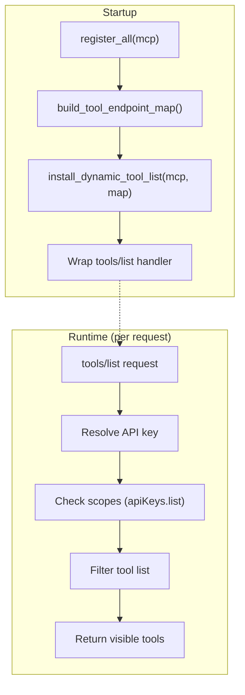
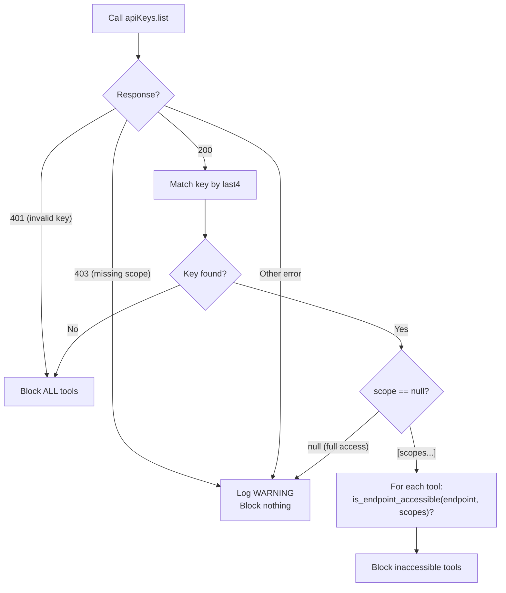

# Dynamic Tool List — Architecture

Per-user filtering of the MCP `tools/list` response based on API key scopes. Disabled by default; enable with `OUTLINE_DYNAMIC_TOOL_LIST=true`.

For configuration and setup, see [Configuration — Dynamic Tool List](configuration.md#dynamic-tool-list).

## Architecture Overview

The system has two phases: **startup** (build metadata maps from tool decorators) and **runtime** (filter `tools/list` per request).



## Startup: Metadata Introspection

Every `@mcp.tool()` decorator carries metadata that drives filtering:

```python
@mcp.tool(
    annotations=ToolAnnotations(readOnlyHint=False, destructiveHint=True),
    meta={"endpoint": "documents.delete"},
)
async def delete_document(...) -> str:
```

After `register_all(mcp)`, `introspect.py` scans all registered tools via `mcp._tool_manager._tools` and builds:

| Map | Source | Purpose |
|-----|--------|---------|
| `tool_endpoint_map` | `meta["endpoint"]` | `{tool_name: "namespace.method"}` — used for scope matching |

This map is passed to `install_dynamic_tool_list()`, which wraps the `tools/list` protocol handler with a filtering function.

## Runtime: Per-Request Filtering

On each `tools/list` call, the wrapped handler:

1. Resolves the API key from `x-outline-api-key` header (HTTP) or `OUTLINE_API_KEY` env var (stdio)
2. Checks the key's scopes via `apiKeys.list`
3. Filters out blocked tools from the response

### Scope-Based Filtering

Calls `apiKeys.list`, finds the key by its last 4 characters, reads the `scope` array, then checks each tool's endpoint against the scopes.



**401 is special**: it means the key is invalid, expired, or revoked — *all* tools are hidden.

**Key not found** is also fail-closed: if the key's last 4 characters don't match any key in `apiKeys.list`, all tools are hidden. This catches deleted or mismatched keys. Every other error fails open.

**last4 collision**: if multiple keys share the same last 4 digits, their scopes are unioned. If any matching key has `scope: null` (full access), the result is treated as full access.

## Scope Matching Algorithm

Mirrors Outline's [`AuthenticationHelper.canAccess`](https://github.com/outline/outline/blob/main/shared/helpers/AuthenticationHelper.ts). Implementation: `scope_matching.py`.

### Scope Formats

**Route scopes** — `/api/namespace.method`

Exact match with `*` wildcard support:

| Scope | Matches |
|-------|---------|
| `/api/documents.info` | `documents.info` only |
| `/api/documents.*` | Any method on `documents` |
| `/api/*.*` | Everything |

**Namespaced scopes** — `namespace:level`

The `level` determines which methods are accessible via a `methodToScope` mapping:

| Method | Maps to scope |
|--------|---------------|
| `create` | `create` |
| `config`, `list`, `info`, `search`, `documents`, `drafts`, `viewed`, `export` | `read` |
| Everything else (`update`, `delete`, `archive`, `restore`, `move`, `redirect`, `export_all`, `answerQuestion`, ...) | `write` (default) |

Level matching:

| Level | Grants |
|-------|--------|
| `read` | Methods that map to `read` |
| `create` | Only the `create` method |
| `write` | All methods (superset of read + create) |

**Wildcard namespace**: `*:read` matches the `read` level on any namespace.

### Gotchas

- `attachments:read` does **not** grant `attachments.redirect` — `redirect` defaults to `write`
- `collections:read` does **not** grant `collections.export_all` — `export_all` defaults to `write`
- Methods that default to `write` scope (not in `methodToScope`): `update`, `delete`, `archive`, `restore`, `move`, `redirect`, `export_all`, `answerQuestion`, `archived`, `deleted`
- Global scopes like `"read"` are broken in Outline v1.5.0 (storage normalisation prepends `/api/`). Use namespaced scopes (`documents:read`) instead

## Interaction with `OUTLINE_READ_ONLY`

When `OUTLINE_READ_ONLY=true`, write modules (content, lifecycle, organization, batch operations) are **never registered**. The dynamic tool list only filters tools that are actually registered. The two systems are independent:

- `OUTLINE_READ_ONLY` controls which modules are **registered** (startup-time, all-or-nothing)
- Scope filtering controls which tools are **visible per-user** (request-time, scope-based)

If both are set, `OUTLINE_READ_ONLY` takes precedence — unregistered tools cannot be shown regardless of the user's scope.

## Error Handling

The system is **fail-open by design** — if the scope check fails, no tools are blocked. This is intentional: the dynamic tool list is a UX convenience, not a security boundary. Outline's API enforces permissions on individual operations regardless.

There are two exceptions: **401 on `apiKeys.list`** (key is invalid/expired/revoked) and **key not found by last4** (key deleted or mismatched). In both cases, all tools are hidden to avoid showing tools that will all fail anyway.

| Scenario | Behavior |
|----------|----------|
| `apiKeys.list` returns **401** | **Block all tools** |
| `apiKeys.list` returns 403 | Log warning, skip scope check |
| `apiKeys.list` returns other error | Skip scope check |
| **Key not found by last4** | **Block all tools** |
| Client init fails | Return full tool list |
| Any unexpected exception in scope check | Skip scope check |

## Module Structure

```
src/mcp_outline/features/dynamic_tools/
├── __init__.py          # Public exports
├── introspect.py        # Startup: build maps from tool metadata
├── filtering.py         # Runtime: per-request filtering logic
├── scope_matching.py    # Pure functions: Outline's scope algorithm
└── CLAUDE.md            # LLM-oriented reference
```

## Adding a New Tool

No changes needed in the dynamic tools module. Just ensure the `@mcp.tool()` decorator has:

1. **`meta={"endpoint": "namespace.method"}`** — the Outline API endpoint for scope matching

The map is built automatically at startup. Integration tests (`test_all_tools_have_endpoint_meta`) verify every registered tool has this metadata.
