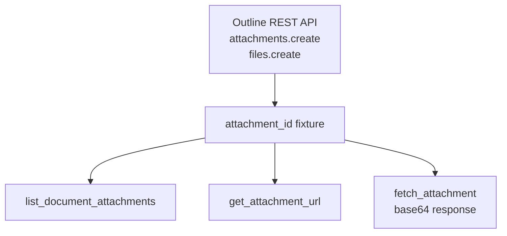

# Attachments

> Auto-generated from `tests/e2e/test_attachments.py`.
> Edit docstrings in the source file to update this document.

E2E tests for attachment tools.

Uploads a real file via the Outline REST API (bypassing MCP), then tests
the read-only MCP attachment tools against that uploaded file. The upload
happens once per module via the ``attachment_id`` fixture.

---

## List Document Attachments

**`test_list_document_attachments`**

Create a doc referencing an uploaded attachment and list attachments.

Guards against: list_document_attachments failing to parse attachment
references embedded in document markdown content.

## Get Attachment Url

**`test_get_attachment_url`**

Resolve an attachment ID to a signed download URL.

Guards against: get_attachment_url returning an error string instead of
a URL, or returning an empty response when Outline generates a redirect.

## Fetch Attachment

**`test_fetch_attachment`**

Download an attachment and verify the base64-encoded response fields.

Guards against: fetch_attachment omitting Content-Type or Content-Base64
headers, which would break AI image-processing workflows.
