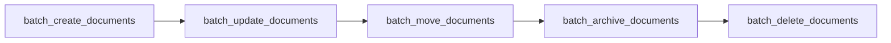

# Batch Operations

> Auto-generated from `tests/e2e/test_batch_operations.py`.
> Edit docstrings in the source file to update this document.

E2E tests for batch operation tools.

Covers bulk create, update, move, archive, and delete in sequence. Each
test is independent: it creates its own collection and documents so that
failures don't cascade.

---

## Batch Create Documents

**`test_batch_create_documents`**

Batch-create two documents in one call and verify both succeed.

Guards against: the batch endpoint creating only the first document or
silently skipping items when the input list has more than one entry.

## Batch Update Documents

**`test_batch_update_documents`**

Batch-rename two documents and verify both report success.

Guards against: batch_update_documents silently failing on individual
items while still reporting an overall success count.

## Batch Move Documents

**`test_batch_move_documents`**

Batch-move two documents from a source to a target collection.

Guards against: batch_move_documents leaving documents in the source
collection or reporting success without actually moving them.

## Batch Archive Documents

**`test_batch_archive_documents`**

Batch-archive two documents and verify both are counted as succeeded.

Guards against: batch_archive_documents silently skipping documents or
returning a partial success count without raising an error.

## Batch Delete Documents

**`test_batch_delete_documents`**

Batch-delete two documents and verify both are counted as succeeded.

Guards against: batch_delete_documents reporting success while leaving
documents in the collection rather than moving them to trash.
