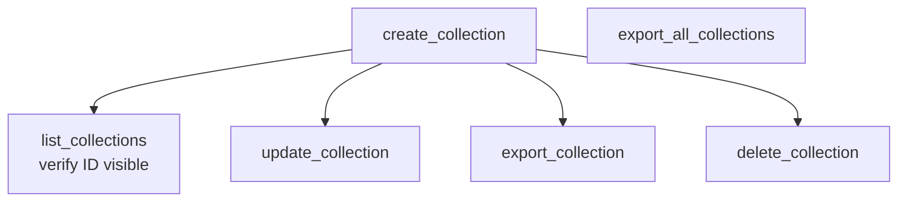

# Collections

> Auto-generated from `tests/e2e/test_collections.py`.
> Edit docstrings in the source file to update this document.

E2E tests for collection management tools.

Covers the full lifecycle of a collection: create, list, update, export,
and delete. Each test exercises a single MCP tool against a live Outline
instance spun up via Docker Compose.

---

## Create Collection Direct

**`test_create_collection_direct`**

Create a collection and confirm it appears in list_collections.

Guards against: regressions where create_collection succeeds but the
new collection is silently omitted from subsequent list responses.

## Update Collection

**`test_update_collection`**

Rename a collection via update_collection and verify the response.

Guards against: update_collection silently no-oping or returning the old
name in the response.

## Export Collection

**`test_export_collection`**

Trigger an async export for a single collection and verify the response.

Guards against: export_collection returning an error when a collection
contains at least one document.

## Export All Collections

**`test_export_all_collections`**

Trigger a workspace-wide export and verify the response format.

Guards against: export_all_collections failing when the workspace has
multiple collections, or the response header being missing.

## Delete Collection

**`test_delete_collection`**

Delete a collection and confirm the success message.

Guards against: delete_collection returning a non-error string that
doesn't confirm deletion, masking silent failures.
