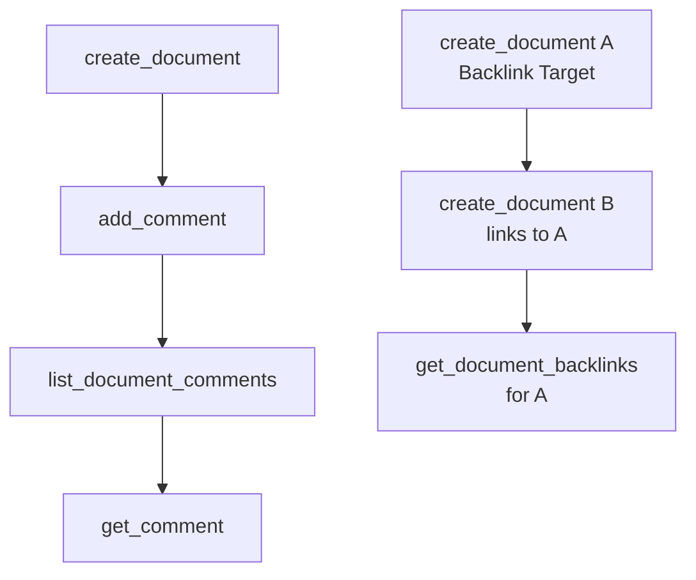

# Comments

> Auto-generated from `tests/e2e/test_comments.py`.
> Edit docstrings in the source file to update this document.

E2E tests for comments and collaboration tools.

Covers threaded comments (add, list, get) and document backlinks. The
backlink test uses a brief sleep because Outline indexes links
asynchronously after a document is created.

---

## Add And List Comments

**`test_add_and_list_comments`**

Add a comment, list comments on the doc, then fetch the comment by ID.

Guards against: add_comment returning success while the comment is
not visible in list_document_comments or get_comment.

## Get Document Backlinks

**`test_get_document_backlinks`**

Create two docs where B links to A, then verify A reports B as backlink.

Outline indexes backlinks asynchronously, so the assertion allows for
"No documents link" as an acceptable response if indexing hasn't caught
up within the sleep window.
Guards against: get_document_backlinks raising an error when no backlinks
have been indexed yet, rather than returning an empty result gracefully.
