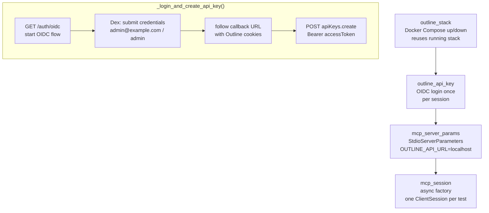

# Conftest

> Auto-generated from `tests/e2e/conftest.py`.
> Edit docstrings in the source file to update this document.

E2E test fixtures for the MCP Outline server.

Manages the Docker Compose stack lifecycle and Outline API
key creation via OIDC/Dex authentication. All fixtures are
session-scoped: the stack starts once, one API key is
created, and one set of server parameters is shared across
every test in the session.

The E2E stack runs in an isolated Docker Compose project
(``mcp-outline-e2e``) on separate ports (3031/5557) so it
never conflicts with a developer's running Outline instance.

Cookie isolation: ``_login_and_create_api_key`` uses manual
cookie management via ``_parse_set_cookies`` instead of
httpx's built-in cookie jar. Both Outline and Dex run on
``localhost`` but on different ports; httpx would otherwise
send Outline session cookies to Dex, causing authentication
failures.

---

##  Outline Is Ready

**`_outline_is_ready`**

Check if E2E Outline is responding.

##  Wait For Outline

**`_wait_for_outline`**

Poll until Outline responds or timeout.

##  Parse Set Cookies

**`_parse_set_cookies`**

Extract cookies from Set-Cookie headers.

##  Login And Create Api Key

**`_login_and_create_api_key`**

Authenticate via OIDC/Dex and return a new API key value.

Four-step flow:
1. GET ``/auth/oidc`` on Outline to start the OIDC redirect
   and capture the initial session cookies.
2. Follow the redirect to Dex, handle optional connector
   selection, parse the login form, and POST credentials.
3. Follow the callback URL back to Outline using the saved
   cookies (manual management — see module docstring).
4. POST to ``apiKeys.create`` using the ``accessToken``
   cookie as a Bearer token and return the key value.

## Outline Stack

**`outline_stack`** *(fixture)*

Ensure the E2E Outline stack is running and manage its lifecycle.

If Outline is already responding on port 3031 (e.g. a developer's
manually started stack), this fixture reuses it and does **not**
tear it down on exit. If it is not running, the fixture starts it
via ``docker compose up -d`` and tears it down with ``down -v``
after the session completes.

Yields the Outline base URL (``http://localhost:3031``).

## Outline Api Key

**`outline_api_key`** *(fixture)*

Create one Outline API key for the entire test session.

Session-scoped so the OIDC login flow runs exactly once regardless
of how many tests are collected. Depends on ``outline_stack`` to
guarantee Outline is reachable before the login attempt.

Returns the raw API key string (``sk-...``).

## Mcp Server Params

**`mcp_server_params`** *(fixture)*

Build ``StdioServerParameters`` pointing at the local E2E stack.

Sets ``OUTLINE_API_URL`` to the localhost Outline instance so the
MCP server under test talks to the E2E stack, not the default cloud
API. The API key from ``outline_api_key`` is injected via the
``OUTLINE_API_KEY`` environment variable.

## Mcp Session

**`mcp_session`** *(fixture)*

Return a factory that creates one ``ClientSession`` per test.

Each call to the returned factory starts a fresh stdio subprocess
and MCP handshake, then yields the initialised session. Using a
factory (rather than a single shared session) keeps tests isolated:
one test's tool calls cannot affect another's server state.

Usage::

    async with mcp_session() as session:
        result = await session.call_tool("some_tool", arguments={})
