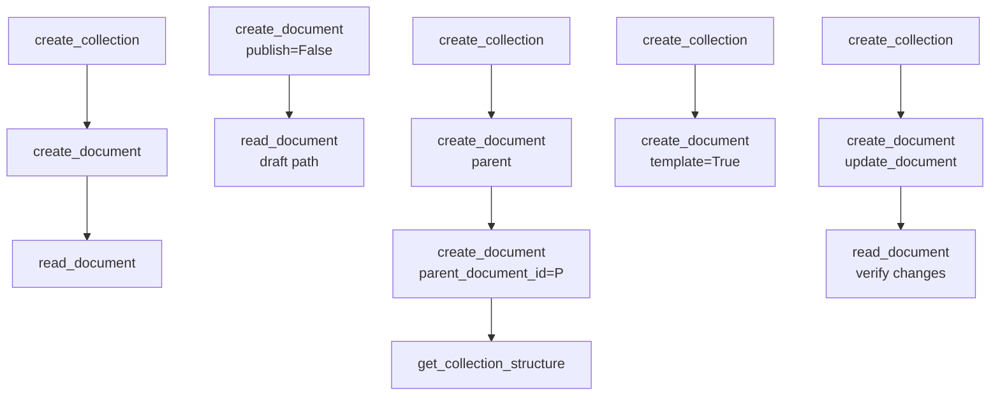

# Documents

> Auto-generated from `tests/e2e/test_documents.py`.
> Edit docstrings in the source file to update this document.

E2E tests for document CRUD tools.

Covers create, read, and update paths including draft, template, and
nested-document variants. Every test creates its own isolated collection
so failures are independent.

---

## Create And Read Document

**`test_create_and_read_document`**

Create a document and verify its title and body via read_document.

Guards against: create_document returning success while the document is
unreadable or missing its content in subsequent reads.

## Document Url In Output

**`test_document_url_in_output`**

Confirm read_document always includes the document URL in its output.

Guards against: the URL field being dropped from the formatter when
Outline's API response changes shape.

## Create Template Document

**`test_create_template_document`**

Create a document with template=True and verify the success response.

Guards against: the template flag being ignored by the API client,
or the response omitting the expected confirmation message.

## Create Nested Document

**`test_create_nested_document`**

Create a child document under a parent and verify the hierarchy.

Creates a parent document, then a child with parent_document_id set,
and confirms both appear in get_collection_structure output.
Guards against: the parent_document_id parameter being silently dropped,
resulting in a flat structure instead of the expected nesting.

## Create Draft Document

**`test_create_draft_document`**

Create a document with publish=False and verify it is still readable.

Guards against: draft documents being inaccessible via read_document,
which would break workflows that stage content before publishing.

## Update Document

**`test_update_document`**

Update a document's title and body, then verify via read_document.

Guards against: update_document reporting success while the underlying
document retains the original content in the Outline API.
