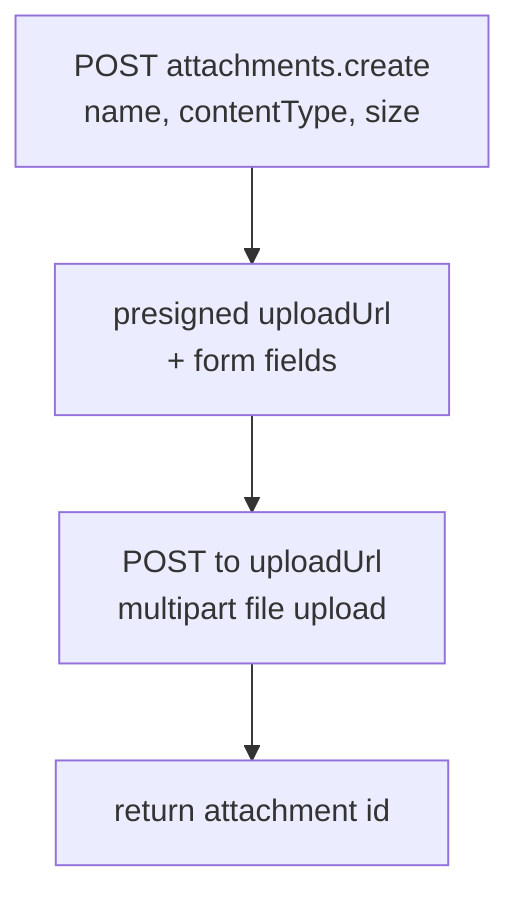

# Helpers

> Auto-generated from `tests/e2e/helpers.py`.
> Edit docstrings in the source file to update this document.

Shared helpers for E2E tests.

Provides two categories of utilities:

- **Result parsing**: ``_text`` and ``_extract_id`` unwrap raw
  ``CallToolResult`` objects into the strings that assertions need.
- **Setup shortcuts**: ``_create_collection``, ``_create_document``,
  ``_create_documents``, and ``_upload_attachment`` reduce boilerplate
  in test bodies. Every test that needs a collection or document calls
  these rather than duplicating ``call_tool`` invocations inline.

``_upload_attachment`` bypasses MCP entirely and calls the Outline REST
API directly — this lets attachment tests seed real uploaded files
without depending on a (non-existent) MCP upload tool.

---

##  Text

**`_text`**

Return the text content of the first item in a CallToolResult.

##  Extract Id

**`_extract_id`**

Extract a UUID from an ``(ID: <uuid>)`` pattern in tool output.

All MCP tools in this server embed the created or affected object's
ID in their success message using this pattern. Raises ``AssertionError``
if no match is found, which produces a clear failure message.

##  Create Collection

**`_create_collection`**

Create a collection via MCP and return its ID.

##  Create Document

**`_create_document`**

Create a document via MCP and return its ID.

##  Create Documents

**`_create_documents`**

Create *count* documents in *coll_id* and return their IDs.

##  Upload Attachment

**`_upload_attachment`**

Upload a file attachment directly via the Outline REST API.

Bypasses MCP entirely — used to seed real uploaded files for tests
that exercise the read-only MCP attachment tools without needing an
MCP upload path.

Two-step flow:
1. POST ``attachments.create`` to obtain a presigned upload URL and
   the required form fields.
2. POST the file to that URL as multipart form data.

Returns the attachment ID string.

Guards against: attachment tool tests failing because no real
attachment was uploaded before the MCP session was opened.
