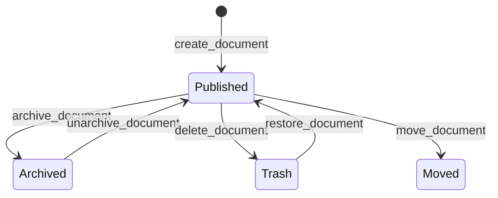

# Lifecycle

> Auto-generated from `tests/e2e/test_lifecycle.py`.
> Edit docstrings in the source file to update this document.

E2E tests for document lifecycle and organization tools.

Covers the three main state transitions a document can undergo: archive/
unarchive, delete/restore (via trash), and cross-collection move.

---

## Archive And Unarchive Document

**`test_archive_and_unarchive_document`**

Archive a document, confirm it's in the archived list, then unarchive.

Guards against: archive_document succeeding but the document not appearing
in list_archived_documents, or unarchive_document failing to restore
normal readability.

## Delete And Restore Document

**`test_delete_and_restore_document`**

Move a document to trash, confirm it's in list_trash, then restore.

Guards against: delete_document permanently deleting rather than moving to
trash, or restore_document failing to make the document readable again.

## Move Document

**`test_move_document`**

Move a document to a target collection and verify via structure.

Guards against: move_document reporting success while the document
remains in the original collection or disappears from both.
