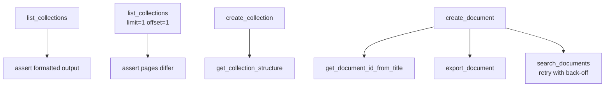

# Search

> Auto-generated from `tests/e2e/test_search.py`.
> Edit docstrings in the source file to update this document.

E2E tests for search and navigation tools.

Covers collection listing (including pagination), collection structure,
title-based document lookup, markdown export, and full-text search.
Search-based tests retry with back-off because Outline indexes documents
asynchronously.

---

## List Collections

**`test_list_collections`**

Confirm list_collections returns valid formatted output.

Guards against: list_collections raising an error on an empty workspace or
returning unformatted raw JSON instead of the expected markdown structure.

## List Collections Pagination

**`test_list_collections_pagination`**

Verify that limit and offset return different pages of results.

Guards against: pagination parameters being ignored, causing both pages
to return identical results.

## Get Collection Structure

**`test_get_collection_structure`**

Fetch the document hierarchy for a collection and verify a doc appears.

Guards against: get_collection_structure returning an empty tree or
raising an error when a collection contains at least one document.

## Get Document Id From Title

**`test_get_document_id_from_title`**

Look up a document's ID by its exact title, retrying while indexing.

Guards against: get_document_id_from_title failing to find a document
that exists, or returning a different document's ID on a title match.

## Export Document

**`test_export_document`**

Export a document and verify its body content is present in the output.

Guards against: export_document returning a success message or header
only, without including the actual document content.

## Search Documents

**`test_search_documents`**

Create a doc with a unique token and find it via search_documents.

Uses a retry loop because Outline's full-text index is updated
asynchronously after document creation.
Guards against: search_documents returning no results immediately after
creation and not retrying, or returning the wrong document.
