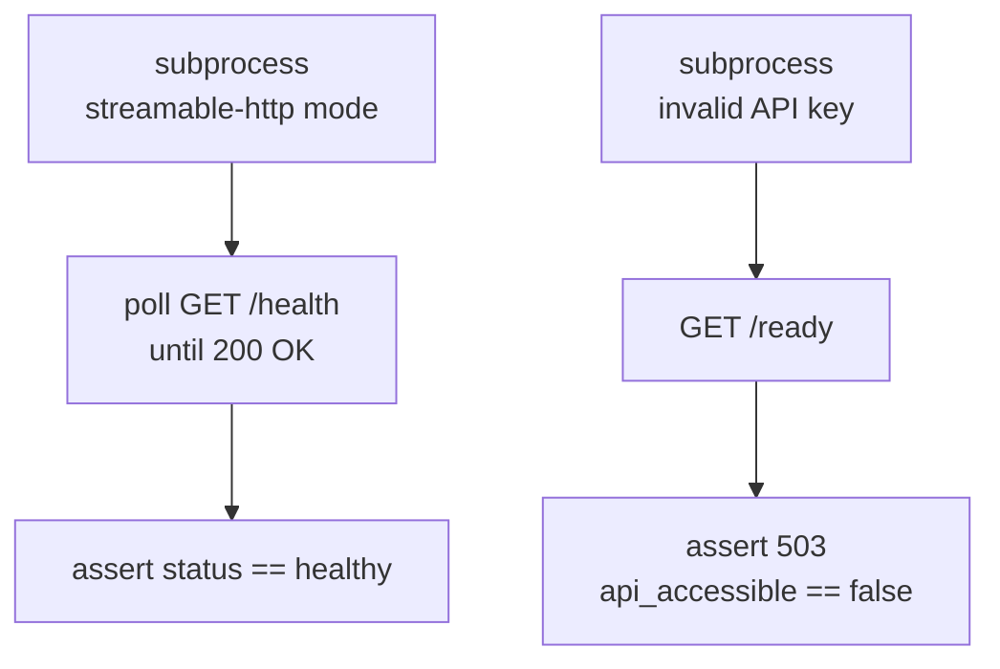

# Health

> Auto-generated from `tests/test_health.py`.
> Edit docstrings in the source file to update this document.

Integration tests for health check endpoints.

Tests the ``/health`` (liveness) and ``/ready`` (readiness) HTTP endpoints
by starting the MCP server as a subprocess in ``streamable-http`` mode and
polling until it binds to its port.

---

## Health Liveness

**`test_health_liveness`**

Start the server and verify GET /health returns 200 with status=healthy.

Guards against: the liveness endpoint being broken during refactors of the
server startup sequence, or the JSON response shape changing.

## Health Readiness Not Ready

**`test_health_readiness_not_ready`**

Verify GET /ready returns 503 when the Outline API key is invalid.

Guards against: the readiness probe returning 200 even when the server
cannot reach the Outline API, which would cause false-positive health
checks in container orchestration.
