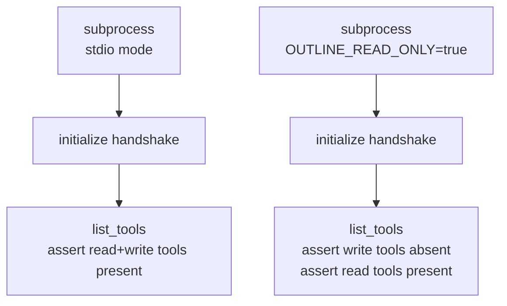

# Mcp Integration

> Auto-generated from `tests/test_mcp_integration.py`.
> Edit docstrings in the source file to update this document.

Integration tests for MCP server functionality.

Starts the actual MCP server as a subprocess and verifies behaviour at the
MCP protocol level — tool registration, read-only mode enforcement, and the
initial handshake.

---

## Mcp Server Integration

**`test_mcp_server_integration`**

Start the MCP server via stdio and verify the handshake and tool list.

Validates that the server starts cleanly, completes the MCP protocol
handshake, and exposes multiple tools with the expected structure.
Guards against: startup crashes, protocol version mismatches, or the
server registering zero tools due to a broken registration chain.

## Read Only Mode Tool List

**`test_read_only_mode_tool_list`**

Verify OUTLINE_READ_ONLY=true omits write tools at the MCP level.

Tests the actual MCP list_tools response, not just Python-level
registration, to catch cases where tools are registered but should not be.
Guards against: read-only flag being ignored so write tools remain
accessible to clients even when the server is configured as read-only.
