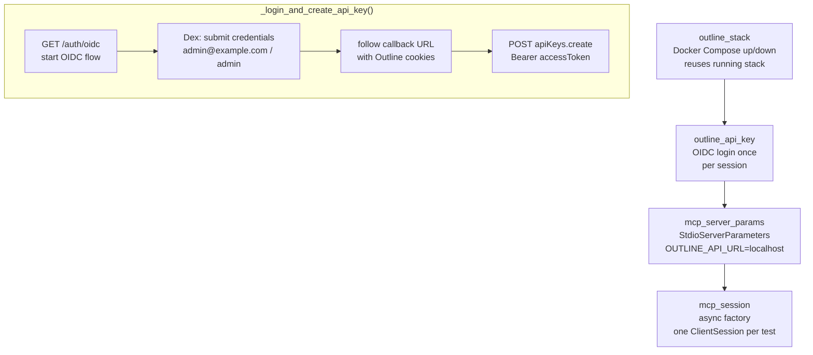

```mermaid
flowchart TD
    subgraph OIDC["_login_and_create_api_key()"]
        OI["GET /auth/oidc\nstart OIDC flow"] --> DC["Dex: submit credentials\nadmin@example.com / admin"]
        DC --> CB["follow callback URL\nwith Outline cookies"]
        CB --> AK["POST apiKeys.create\nBearer accessToken"]
    end

    OS["outline_stack\nDocker Compose up/down\nreuses running stack"] --> OAK["outline_api_key\nOIDC login once\nper session"]
    OAK --> MSP["mcp_server_params\nStdioServerParameters\nOUTLINE_API_URL=localhost"]
    MSP --> MS["mcp_session\nasync factory\none ClientSession per test"]
```
