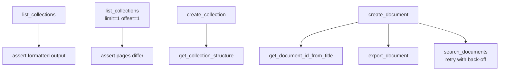

```mermaid
flowchart TD
    LC[list_collections] --> OK1[assert formatted output]
    LCP[list_collections\nlimit=1 offset=1] --> OK2[assert pages differ]
    CC[create_collection] --> GCS[get_collection_structure]
    CD[create_document] --> GID[get_document_id_from_title]
    CD --> ED[export_document]
    CD --> SD[search_documents\nretry with back-off]
```
