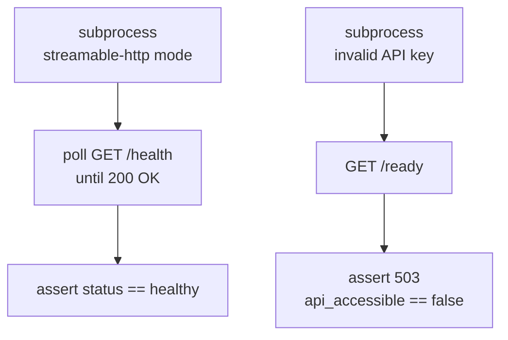

```mermaid
flowchart TD
    S[subprocess\nstreamable-http mode] --> H[poll GET /health\nuntil 200 OK]
    H --> L[assert status == healthy]

    S2[subprocess\ninvalid API key] --> R[GET /ready]
    R --> NR[assert 503\napi_accessible == false]
```
